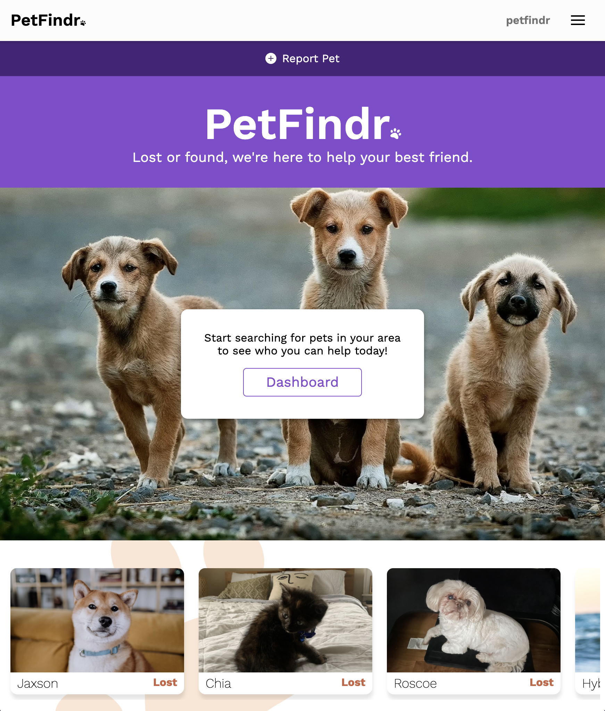
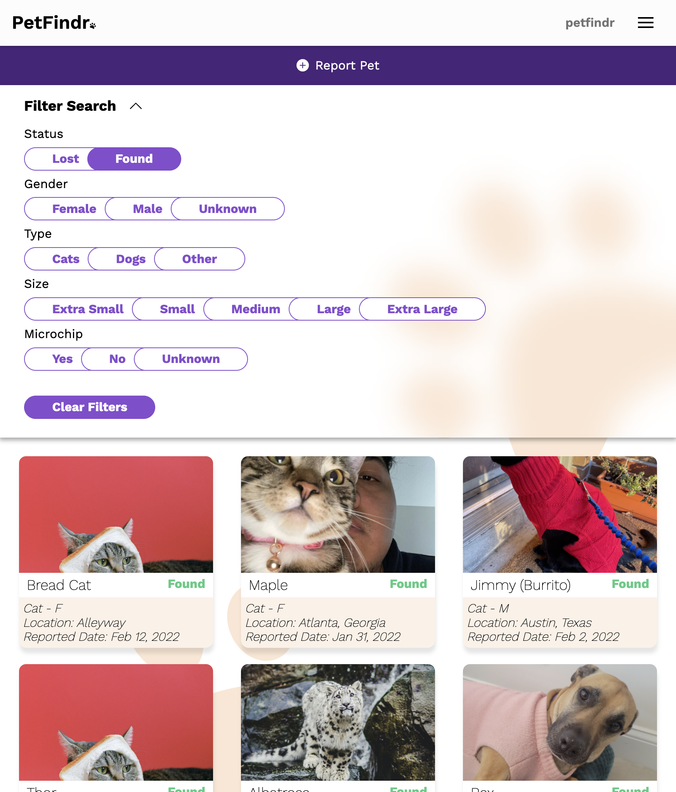
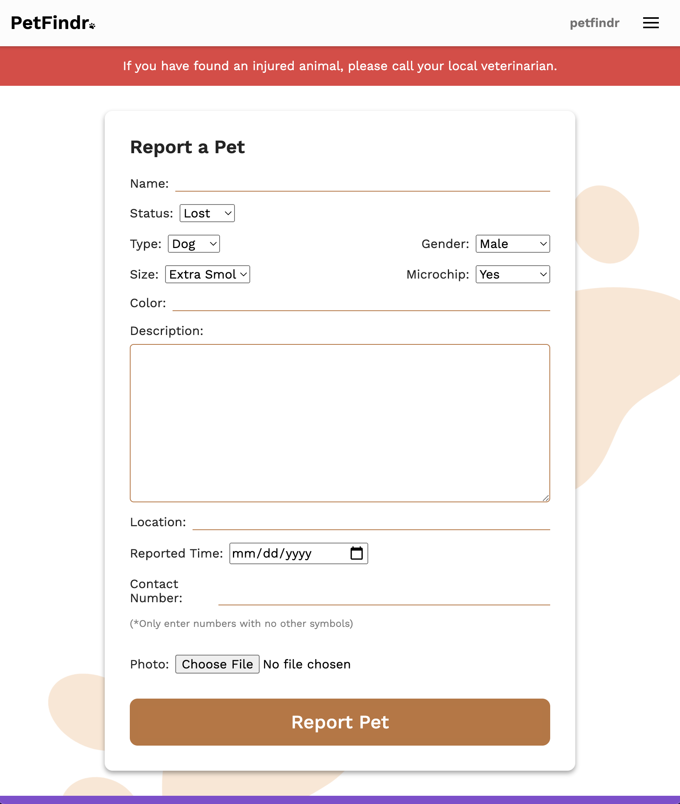
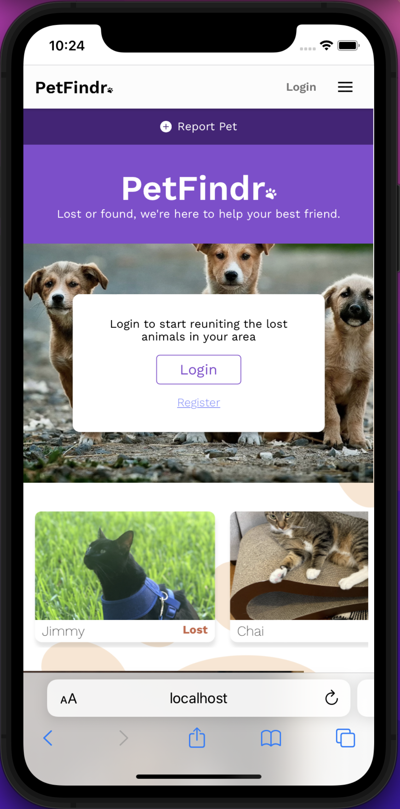
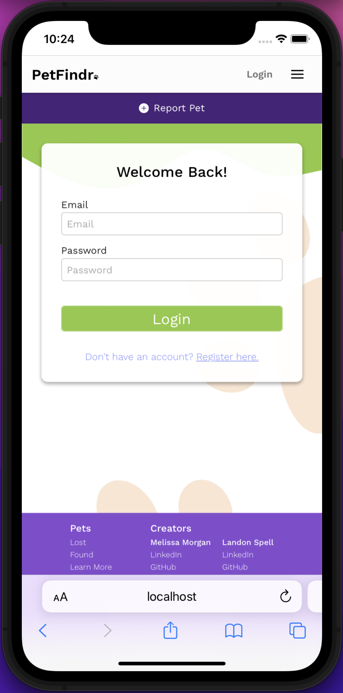

# [Petfindr](https://petfindr.netlify.app/)

## Project Description

Petfindr is the place to go for any pet whether lost or found. If you have lost a pet, you can browse our dashboard to see if anyone has posted about your lost furry friend! If they are reported as found, you can contact them right from the website! You can also post any pets that you have found to help reunite pets and owners!

## Technologies Used

- React
- React-Router-Dom
- JavaScript
- CSS, flexbox, css:selectors
- HTML
- Font Awesome Icons
- Framer Motion
- Moment.js

## Installation Instructions

To install this repository:

- If you would like to fork the repository so you have your own copy, feel free to!
- Click on the green "Code" button.
- Copy either the HTTPS or SSH link that is provided (SSH is preferred)
- Open up the Terminal and navigate to the desired directory location
- Once inside, use the code "`git clone` copied_link_here"
- Once the repo has been installed, change into the directory with `cd pet-findr-frontend`
- From here you can run `code .` to open it up in VS Code

# Final Product Images

## Desktop

### Landing

### Filter Search

### Report A Pet

## Mobile

### Landing

### Login

## Planning Process

### User Stories

#### MVP

- As a user, I want to be able to see a list of found pets, so I can search through them and locate my missing pet.
- As a user, I want to be able to report any lost pet that I have found with that pet's information, so other users can see.
- As a user, I want to be able to report my missing pet, so other people can keep an eye out for them.
- As a user, I want to be able to contact the user who posted the missing/found pet, so the family can be reunited.
- As a user, I would like to be able to remove my listing once the pet has been reunited with their family.

#### Stretch Goals

- ✅ As a user, I want to be able to share missing/found pet info on social media, so I can extend the reach of a pet’s post.
- ✅ As a user, I want to be able to filter and sort results based on different qualities, so that I can better find the pet I am looking for.
- ½ As a user, I want to be able to search for specific pets.
- ½ As a user, I want to be able to have my own account, so that I can keep track of my listings as well as users I have contacted.
- ✅ As a user, I would like to see a timestamp of when the pet was posted.
- ✅ As a user, I want to be able to upload a photo instead of a photo URL.

## Major Hurdles / Unsolved Problems

### Unsolved Problems

- Implementing search by name, location, zipcode and other additional parameters.
- Adding the pets to each user so you can easily access them via the user profile page.
- Additional functionality behind the user profile page.

### Major Hurdles

- Getting used to Framer Motion and moving away from typical vanilla CSS animation techniques was a little hard to get used to.
- Bringing in the functionality from the API to get certain user information.
- Persisting the user info and logged in status throughout the site. 
